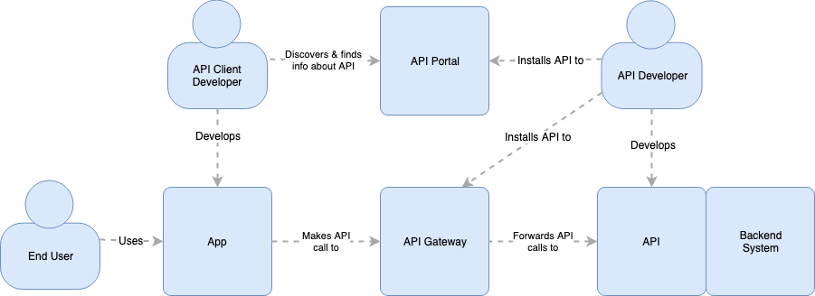

# Equinor API Strategy 

## Introduction
Application programming interfaces (APIs) are a core element of any digital business platform. APIs provide the interfaces between apps, data and services. These interfaces enable the connection between people, businesses and things. With proper management, APIs can be an enabler for innovation, faster development of digital products and new business models. This can positively affect the profitability of the company, a concept referred to in the industry as _the API Economy_. 

With the latest version of TR1621 (v7), Equinor is heading in an "API first" direction; software components should offer APIs to communicate with other components, share data and functionality. To further capitalize on the potentials of the API Economy, Equinor is establishing an API Strategy. The API strategy outlines the direction for management, design and development of APIs in Equinor. The [Equinor REST API Guidelines](rest_guidelines.md) is an accompanying document containing guidelines and recommendations specifically for REST API design.

This document distinguish between 4 categories of APIs, based on target audience; _app-private_, _private_, _partner_ and _public_. See the [Appendix](#api-categories) for a description of each category.

# Table Of Contents

* [Goals](#goals)
* [API Platform](#api-platform)
* [API Management Tools and roles](#api-management)
    * [API Portal](#api-portal)
    * [API Gateway](#api-gateway) 
    * [API developer](#api-developer)
    * [API client developer](#api-client-developer)
    * [End user](#end-user)
* [API Design](#api-design)
    * [Design Principles](#design-principles)
        * [API First](#api-first)
        * [API As a Product](#api-as-a-product)
        * [Be prepared to externalize](#externalize)
    * [Consistency](#consistency)
    * [OPC UA](#opc-ua)
* [API Security](#api-security)
* [Appendix](#appendix)
    * [API Categories](#api-categories)
    * [What is REST?](#what-is-rest)
* [References & useful links](#references)

## Goals

The goal of the API Strategy is to deliver a number of operational and strategic benefits to Equinor:

- **Increased efficiency in software development.** Getting access to data, often from another team or part of the organization, can be a time consuming process for development teams. In many cases, the consumers of these data need to do similar processing. By being able to reuse existing APIs providing data and processing capabilities - rather than building from scratch - development teams can develop new applications faster.
- **Increased agility in software architecture**. By building our applications on top of APIs and applying [microservice architecture principles](https://martinfowler.com/articles/microservices.html) we can create a more agile software architecture, making our software systems more adaptable to change. An agile architecture will in turn support the business becoming more agile.
- **Revitalize legacy applications.** Integrating with legacy applications is often difficult due to technical barriers and knowledge gaps. Consequently, these monolith's data and functionalities are often only accessible within the systems themselves. By building modern APIs on top of legacy systems, we can extract more value by making their abilities broadly and easily available. The APIs can also serve as an abstraction layer that can facilitate modularization and modernization. 
- **Enabler for Innovation** The availability of and easy access to a broad range of data and functionality can facilitate innovation. By combining data in new ways we can potentially gain new insights and build new services that brings added value to the company. The API Platform can enable innovation internally on our private APIs, but possibly also on public APIs by external parties (without direct investment by Equinor).
- **New business opportunities.** A number of businesses are getting significant income from the "API Economy". A common model of operation is to offer public APIs where the clients pay for consumption (as subscription or pr request). Another approach is to offer free public APIs where clients indirectly contributes to revenue by growing an existing business platform or ecosystem. Providing APIs to selected business is a third approach where new (or existing) business relationships is strengthened by API integration.

## API Platform

To reach the goals of the API Strategy, Equinor will establish an **API platform** exposing a significant part of Equinor data and functionality through APIs. Key characteristics of the API platform:

- **Well crafted, secure APIs.** The APIs in the platform should be crafted according to industry standards with high emphasis on security.
- **API discoverability.** Which APIs exists in the platform and what capabilities they have should be easy to discover for API consumers.
- **Developer experience (DX).** The user experience for developers (a.k.a. developer experience) that develop API clients is key for adoption of the APIs. A good DX requires well designed APIs, API documentation, self-service based access, useful error messages, predictability in operations, etc.

## API Management Tools and roles

API Management tools are key to supporting a secure and effective API development process and reaching the goals of the API Strategy. The figure below describes how these tools fits into the system context of a typical private or public API, including interacting roles.

### API Portal
The API Portal is the central API registry, and the main tool to achieve _API discoverability_. The Equinor API portal is available at <https://api.equinor.com> and is implemented on top of [Microsoft Azure API Management](https://azure.microsoft.com/en-us/services/api-management). 

Key characteristics:

- Provides self service mechanisms for API client developers to gain access to APIs
- _All_ private and public APIs shall be published in the API Portal. App-private and partner APIs may be published if needed.
- Provides configurable _visibility_ of APIs
  - App-private APIs - if listed in the API portal - should only be visible to relevant client developers
  - Private APIs should be visible to everyone in Equinor (i.e. to all users in Equinor AD)
  - Partner APIs may have public or limited visibility, depending on the need for the particular API 
  - Public APIs should be visible to everyone internally and externally

The API portal should provide the following information about each API:
  
- Interface description: operations, input/output data, error codes
- Downloadable [OpenAPI specification](https://swagger.io/specification/)
- Access requirements, including information about how to apply for access
- Links to Terms of Service and SLA for the API, if such documents exists

### API Gateway
The API Gateway provides key security, bridging and monitoring features. Equinor uses [Microsoft Azure API Management](https://azure.microsoft.com/en-us/services/api-management) as API Gateway. APIs exposed through the API Gateway will be available at a subURL of `api.equinor.com`. Azure API Management provides the following key features:

- Security features like throttling and IP restrictions, JWT token validation, HTTP header validation
- Authentication policies
- Response caching
- Monitoring
- Access to APIs on the on-prem network through Azure ExpressRoute
  
The figure above also describes the interaction between API management tools and key roles. Please note that the developer roles represent personas/stereotypes, and will generally be the responsibility of a software DevOps team.

### API developer
The API developer creates the API on top of a backend system, and manage the API through its lifecycle. The API developer publishes the API to the API Gateway and API Portal, and is responsible for ensuring that the API is well crafted, secure and properly documented. He/she also needs to consider topics like versioning strategy, should an SLA and/or Terms of Service be created, how to receive feedback from API client developers, etc.

### API client developer
This is the developer of an app that consumes the API. The API client developer will use the API portal to discover the existence of APIs and find relevant information about them. A key factor deciding whether an API client developer will use a particular API is the developer experience (DX) of that API. He/she is much more likely to start and keep using an API if the DX is good, and also recommend the API to others. Without a proper DX the API client developer will probably look for alternatives.

### End user
This is the user of the client app, and consumer of the data and functionality exposed by the API. The end user's primary concern is the stability and availability of the app, often (happily) unaware of the chain of dependencies behind.

## API Design

### Design Principles

#### API First
API First is one of our core API design principles. API First has two key elements:

- Define the API using a standard specification language before any line of code is written
- Get feedback on the API definition from team members and client developers

With the API first approach, we can achieve

- Evolving the API and learn about it’s usage in an efficient matter, without having to write any code
- Decoupling of API design and development. The API definition becomes a contract that teams can work on without having to wait for the implementation to be completed. And the implementation can be changed / replaced without impacting the clients.
- Specifying APIs with a standard specification language facilitates usage of tools for generating documentation, mock code, automatic quality checks, API Management tools, etc.

#### API As a Product
A key factor to enable the evolution of an API platform is treating our APIs as products.

Key elements in the API as a product principle:

- Focus on the users - your customers. Put yourself in their place, understand their needs
- Put emphasis on the user experience (developer experience) - usability, simplicity, etc. Take care not exposing any inner workings, implementation details, or internal naming schemes in the API
- Improve the product/API over time
- Make use of customer feedback

#### Be prepared to externalize
Assuming your API will forever remain within the current scope can limit the potential of the API. In many cases APIs are initially developed for a particular client. Because there is (currently) only one client, API developers might be tempted to lower the standards for the API, and go easy on design, specification, documentation, etc. Then, when other parties are interested, there might be a backlog of things to improve before new clients can start consuming. Similarly, with a particular client in mind, the API could easily be designed with unnecessary optimizations making it less suited for other clients.

With the rate of change in our industry, assumptions about scope and visibility of the API might change quickly. An important principle for our API development is to _develop the APIs in such a way that it is ready to be made available outside its current scope_. This could mean opening an app-private API to everyone in Equinor (private), opening it to external business partners or as a public API on the Internet. 

APIs should only be _app-private_ if it contains necessary optimizations that makes in unsuitable for other clients, or the API metadata have a security classification that prevents the API from being private (and visible to everyone in the company). 

### Consistency
To facilitate API adoption and make it easier to do reviews between teams following the API First principle, we should strive for _consistency_ in our APIs. REST is the preferred API mechanism in Equinor, except for industrial automation, where [OPC UA](#opc-ua) is the preference. The [Equinor REST API Guidelines](rest_guidelines.md) is an accompanying document containing guidelines and recommendations specifically for REST API design.

Other protocols like GraphQL, AMQP and MQTT may be used when they bring significant benefits. But keep in mind that these protocols are not supported by the OpenAPI specification nor by our [API portal](#api-portal) & [API gateway](#api-gateway), and are best suited for app-private APIs.

### OPC UA
[OPC](https://opcfoundation.org/about/what-is-opc/) Unified Architecture ([OPC UA](https://opcfoundation.org/about/opc-technologies/opc-ua/) / IEC 62541) is an open interoperability standard for secure and reliable exchange of data in industrial automation / OT.  The standard defines interface that includes access to real-time data, monitoring of alarms and events, access to historical data and other applications.

OPC UA is the preferred connectivity framework within industrial automation in Equinor, and will also be used to connect and integrate industrial automation and control systems (OT) with enterprise systems, business processes and analytics (IT).

Further readings:

- [OPA UA explained in 1 minute (movie)](https://www.youtube.com/watch?v=-tDGzwsBokY)
- [Industrial Internet Vocabulary](https://www.iiconsortium.org/vocab/index.htm)

## API Security
Equinor APIs should be crafted with high emphasis on security. Code quality is a key foundation for API security. Like other software, APIs should be built by following recognized practices for software development. Examples of such practices includes code review, test driven development (TDD), automated testing, technical debt management & refactoring, etc.

### Security tools and practices
Development teams should include practices and tools addressing security issues in their development process. Automatic vulnerability scanning and keeping dependencies updated accordingly, is strongly recommended. Scanning for vulnerabilities in open source dependencies is mandatory. Teams should stay updated on [OWASP API Security Top 10](https://owasp.org/www-project-api-security/), and do regular evaluation on how these security risks are mitigated.

API developers should understand and utilize the security features provided by the [API Gateway](#api-gateway), like throttling, IP restrictions and HTTP header validation.

### Encrypted transport
APIs shall use an encrypted transport mechanism to secure the API connections, ensure data integrity, preserve privacy and authenticate the providing server. Transport Layer Security (TLS) is mandatory for all HTTP-based APIs.

### Input validation
Reduce the likelihood of [injection attacks](https://owasp.org/www-project-top-ten/OWASP_Top_Ten_2017/Top_10-2017_A1-Injection) by validating and sanitizing API inputs. Examples of such measures includes type and format checks, length and range checks, JSON or XML schema validation, file upload validation, etc. Validation libraries are available for most API/web development ecosystems, e.g. [Fluent Validation](https://fluentvalidation.net/), [Django Validators](https://docs.djangoproject.com/en/3.0/ref/validators/), [express-validator](https://express-validator.github.io/docs/), [Apache Commons Validator](https://commons.apache.org/proper/commons-validator/), etc.

For more information, see [OWASP Input Validation Cheat Sheet](https://cheatsheetseries.owasp.org/cheatsheets/Input_Validation_Cheat_Sheet.html).

### Monitoring
System monitoring, including monitoring of APIs, provide the capability to detect actual or attempted attacks on IT systems. Monitoring will also ensure that our systems and APIs are being used appropriately and in accordance with API usage policies. All Equinor APIs providing sensitive information shall be monitored. The monitoring should include detection of unusual behaviors, like changes in IP addresses, changes in number of requests or APIs being used at unusual times of day, etc.

For more information, see [UK National Cyber Security Center Monitoring guidance](https://www.ncsc.gov.uk/collection/10-steps-to-cyber-security/the-10-steps/monitoring)

### Authentication and authorization
The company identity provider (IdP) is the basis for for authentication and authorization of Equinor APIs. Hardcoded usernames and passwords shall be avoided. OAuth2 and Open ID Connect (OIDC) are the preferred and recommended protocols for authorization and authentication of HTTP-based APIs. 

Further reading:

- [The OAuth 2.0 Authorization Framework - RFC6749](https://tools.ietf.org/html/rfc6749)
- [OpenID Connect official documentation](https://openid.net/connect/)
- [OAuth 2.0 Threat Model and Security Considerations](https://tools.ietf.org/html/rfc6819)
- [OAuth 2.0 Security Best Current Practice](https://tools.ietf.org/html/draft-ietf-oauth-security-topics-14)

### OPC UA Security
[OPC UA](#opc-ua) has an extensive and flexible security architecture. Recommendations and guidelines can be found in the white paper _Practical Security Recommendations for Building OPC UA Applications_, available for download from [OPC Foundation](https://opcfoundation.org/security/).

## Appendix
### API Categories
In this document we distinguish between 4 API categories

| Term | Description |
| :--- | :--- |
| App-private | app-private APIs are available to a limited set of clients, within the same functional scope. These APIs are typically optimized for a particular consumer, like a web or mobile client. app-private APIs are sometimes referred to as _application-private_ or _app-internal_ APIs.|
| Private | Private APIs are available to clients within the company. Private APIs are sometimes referred to as _internal_ APIs. |
| Partner | Partner APIs are available to selected business partners |
| Public | Public APIs are publicly available on the Internet |

## References & useful links

### OpenAPI Specification
- [OpenAPI Specification](https://github.com/OAI/OpenAPI-Specification/)
- [OpenAPI Specification - Web Page](https://swagger.io/specification/)
- [OpenAPI Specification Mind Map](https://openapi-map.apihandyman.io/)

### Publications, articles & guidelines
- [Equinor REST API Guidelines](rest_guidelines.md)
- [Roy Fielding Dissertation - Architectural Styles and the Design of Network-based Software Architectures](https://www.ics.uci.edu/~fielding/pubs/dissertation/top.htm)
- [REST API Tutorial](https://www.restapitutorial.com/)
- [Microsoft Azure REST design guidelines](https://docs.microsoft.com/en-us/azure/architecture/best-practices/api-design)
- [Zalando API Guidelines](https://opensource.zalando.com/restful-api-guidelines)
- [Richardson Maturity Model](http://martinfowler.com/articles/richardsonMaturityModel.html)
- [Microservice Architecture Principles](https://martinfowler.com/articles/microservices.html)
- [OPC UA](https://opcfoundation.org/about/opc-technologies/opc-ua/)

### Blogs & blog posts
- [Nordic APIs](https://nordicapis.com/)
- [API Evangelist](http://apievangelist.com/)
- [API Design - The guidelines (Hacker Noon)](https://hackernoon.com/restful-api-designing-guidelines-the-best-practices-60e1d954e7c9)
